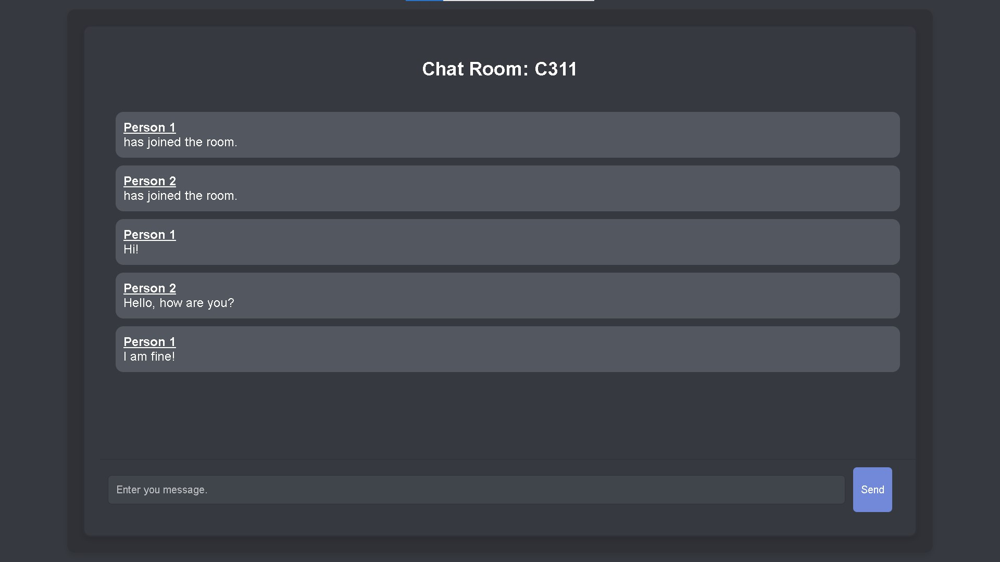

# Chat Room Application

This is a simple chat room application built using Flask, Socket.IO, and JavaScript. Users can join chat rooms, send messages, and see messages from other users in real-time.



## Features

- Join existing chat rooms or create new ones
- Real-time messaging using WebSockets
- User-friendly interface with consistent styling

## Installation

1. Clone the repository:
    ```sh
    git clone https://github.com/UniquePython/ChatRoom.git
    ```

2. Create a virtual environment and activate it:
    
    - On Windows
    ```sh
    python -m venv venv
    venv\Scripts\activate  
    ```

    - On macOS/Linux
    ```sh
    python3 -m venv venv
    source venv/bin/activate
    ```

1. Install the required dependencies:
    ```sh
    pip install -r requirements.txt
    ```

## Running the Application

1. Start the Flask application:
    ```sh
    python main.py
    ```

2. Open your web browser and navigate to [localhost](http://127.0.0.1:5000).

## Project Structure

- [main.py](main.py): The main Flask application file.
- [templates](templates/): Contains HTML templates.
  - `base.html`: Base template with common layout.
  - `home.html`: Home page template where users can join or create chat rooms.
  - `room.html`: Chat room template where users can send and receive messages.
- [style.css](static/css/styles.css): Contains the CSS styles for the application.

## License

This project is licensed under the MIT License. See the [LICENSE](LICENSE) file for details.

## Acknowledgements

- Flask: [Website](https://flask.palletsprojects.com/)
- Socket.IO: [Website](https://socket.io/)
- Tech With Tim: [Youtube Video](https://www.youtube.com/watch?v=mkXdvs8H7TA)